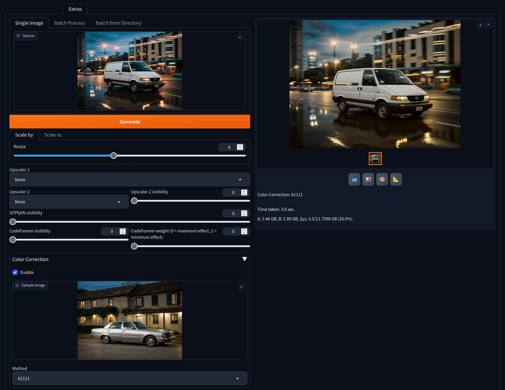

# Color Correction Extras

This simple extention adds native color correction feature from [stable-diffusion-webui](https://github.com/AUTOMATIC1111/stable-diffusion-webui) into its "Extras" tab

So, you can use this feature in postprocessing

If you have installed [StableSR](https://github.com/pkuliyi2015/sd-webui-stablesr) extention, you can choose its color correction methods from dropbox "Method". It's optional
